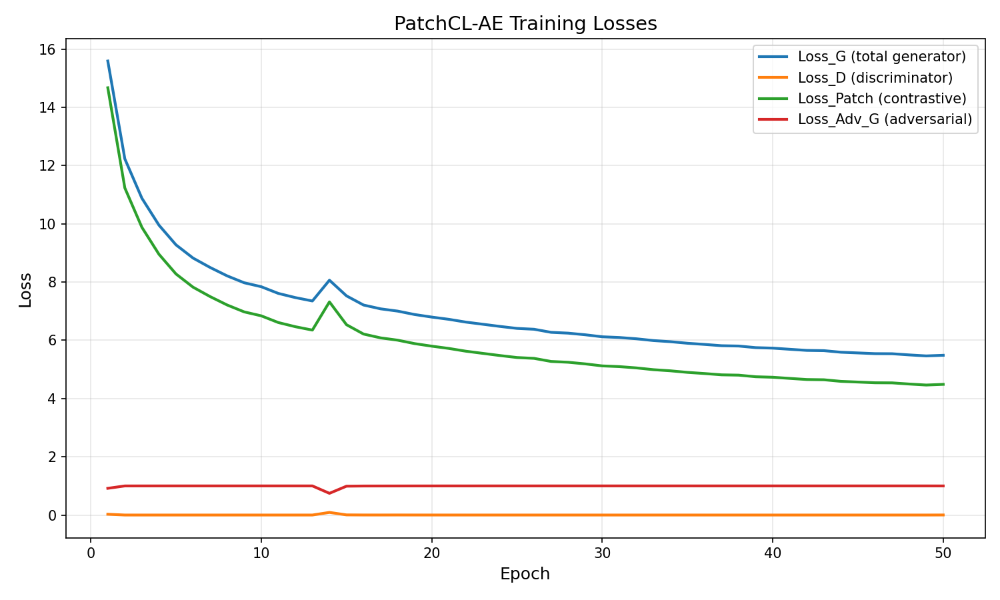
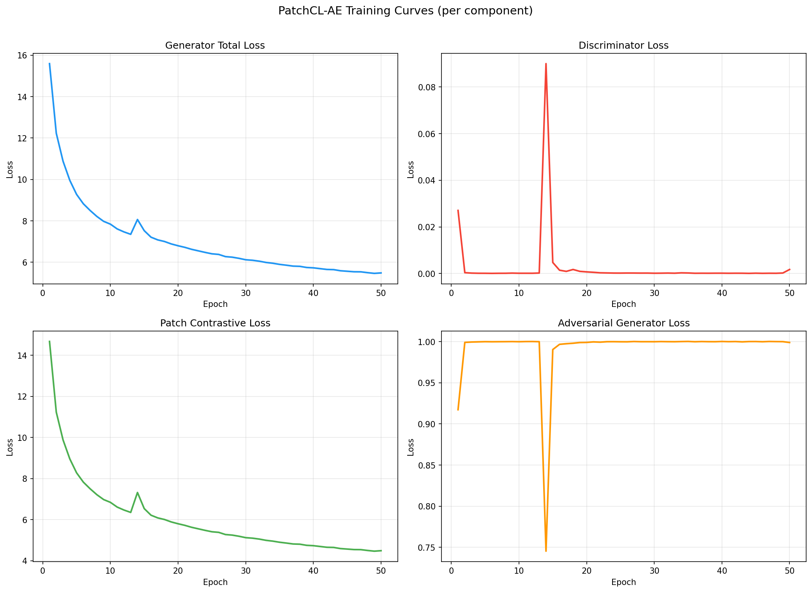
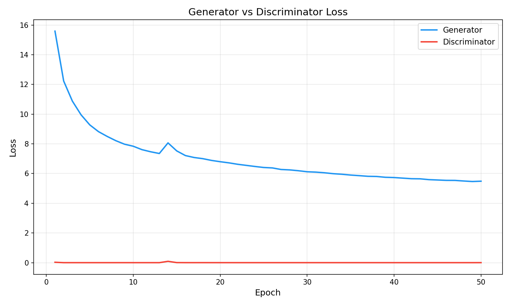
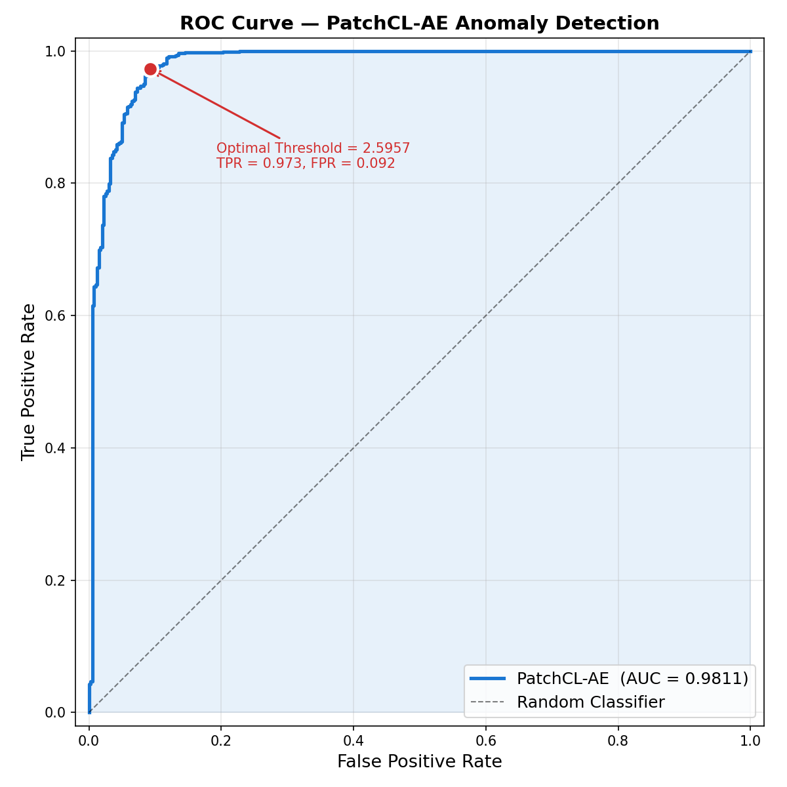
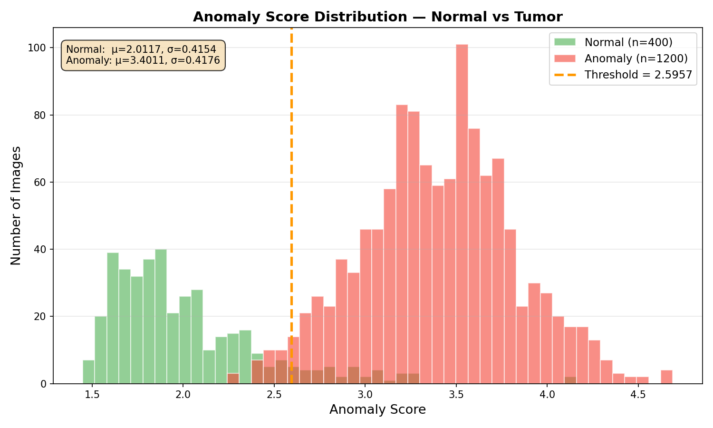
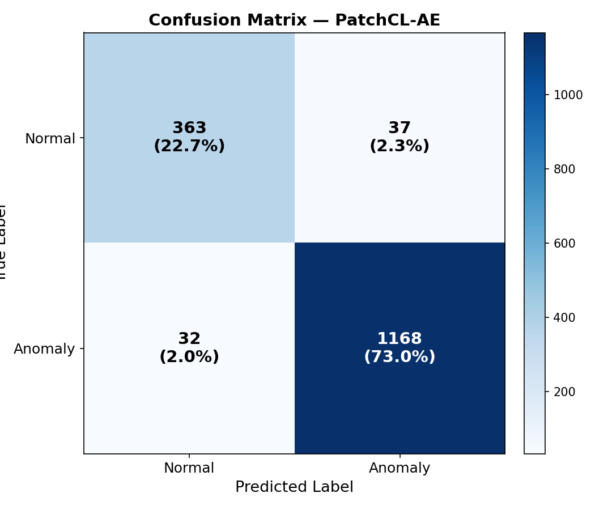
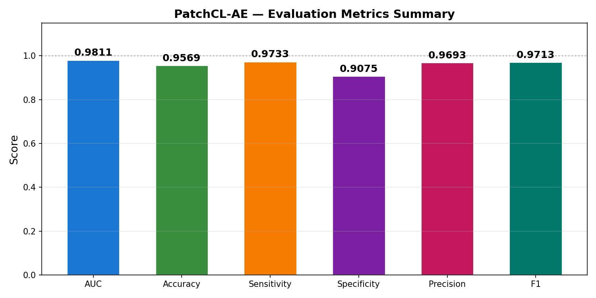
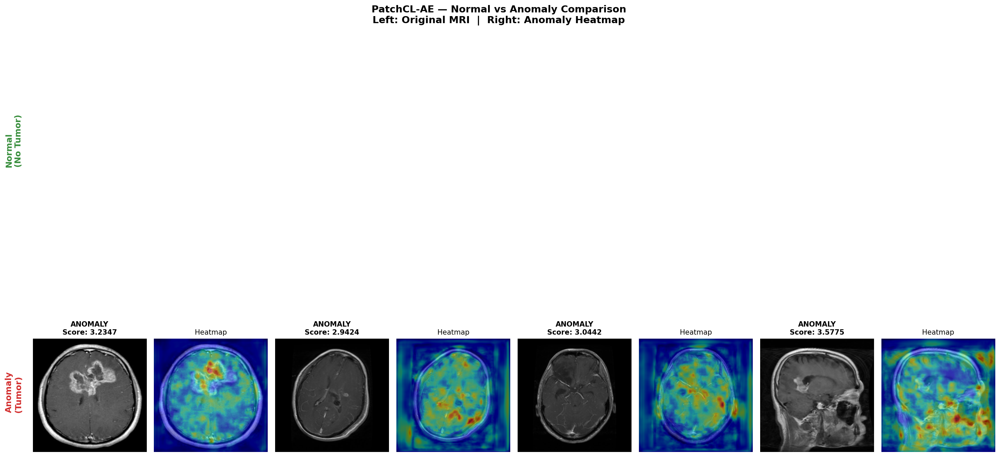

# PatchCL-AE: Patch-wise Contrastive Learning Auto-Encoder for Brain Tumor MRI Anomaly Detection

> **A complete beginner-friendly report** — from the medical problem to the deep learning solution, architecture, training, evaluation, and results.

---

## Table of Contents

1. [The Problem: Why Do We Need This?](#1-the-problem-why-do-we-need-this)
2. [The Dataset: Brain Tumor MRI](#2-the-dataset-brain-tumor-mri)
3. [The Solution: PatchCL-AE (Our Approach)](#3-the-solution-patchcl-ae-our-approach)
4. [Model Architecture (How It Works Inside)](#4-model-architecture-how-it-works-inside)
5. [Loss Functions (How the Model Learns)](#5-loss-functions-how-the-model-learns)
6. [Training Pipeline](#6-training-pipeline)
7. [Evaluation & Anomaly Detection (How We Test)](#7-evaluation--anomaly-detection-how-we-test)
8. [Results & Visualisations](#8-results--visualisations)
9. [How to Run the Code](#9-how-to-run-the-code)
10. [Project Structure](#10-project-structure)
11. [Requirements](#11-requirements)

---

## 1. The Problem: Why Do We Need This?

### 1.1 Brain Tumors are Life-Threatening

Brain tumors are abnormal growths of cells inside the brain. They can be:

| Type | Description |
|------|-------------|
| **Glioma** | Tumors arising from glial cells (support cells of the brain). Can be low-grade or high-grade (aggressive). |
| **Meningioma** | Tumors in the meninges (protective membranes around the brain). Usually benign but can compress brain tissue. |
| **Pituitary** | Tumors in the pituitary gland (at the brain's base). Affect hormone production. |

Early and accurate detection through **MRI scans** is critical for treatment planning. However, manually reviewing thousands of MRI slices is:
- **Time-consuming** for radiologists
- **Prone to human error** (especially for subtle tumors)
- **Expensive** (requires trained specialists)

### 1.2 The Machine Learning Challenge

A typical approach is **supervised classification** — train a model on labelled examples of each tumor type. But this has limitations:

- **New/rare tumor types** might not appear in the training set
- **Annotation cost** is extremely high (requires expert radiologists)
- The model can only detect what it has been explicitly taught

### 1.3 A Better Idea: Anomaly Detection

Instead of teaching the model *"what tumors look like"*, we teach it **"what a NORMAL brain looks like"**. Then, anything that deviates from normal is flagged as an **anomaly** (potential tumor).

```
┌─────────────────────────────────────────────────────────┐
│                  ANOMALY DETECTION IDEA                  │
│                                                         │
│   Training:   Learn ONLY from normal brain MRIs         │
│   Testing:    Flag anything "abnormal" as anomaly       │
│                                                         │
│   ✅ No need for tumor labels during training           │
│   ✅ Can detect ANY abnormality (even unseen types)     │
│   ✅ Requires only normal data to train                 │
└─────────────────────────────────────────────────────────┘
```

This is exactly what **PatchCL-AE** does.

---

## 2. The Dataset: Brain Tumor MRI

We use the **Brain Tumor MRI Dataset** from Kaggle, which contains 4 classes of brain MRI images.

### 2.1 Dataset Structure

```
data/
├── Training/                        ← Used for training
│   ├── notumor/     (395 images)    ✅ ONLY this class used for training
│   ├── glioma/      (NOT used)      ❌ Ignored during training
│   ├── meningioma/  (NOT used)      ❌ Ignored during training
│   └── pituitary/   (NOT used)      ❌ Ignored during training
│
└── Testing/                         ← Used for evaluation
    ├── notumor/     (400 images)    → Label 0 (Normal)
    ├── glioma/      (400 images)    → Label 1 (Anomaly)
    ├── meningioma/  (400 images)    → Label 1 (Anomaly)
    └── pituitary/   (400 images)    → Label 1 (Anomaly)
```

### 2.2 Key Decisions

| Decision | Explanation |
|----------|-------------|
| **Train on `notumor` only** | The auto-encoder learns to reconstruct ONLY normal brains. It never sees any tumors during training. |
| **Binary labels at test time** | `notumor` → Normal (0), all other classes → Anomaly (1). We don't distinguish tumor types — we only care about normal vs abnormal. |
| **Image size: 256×256** | All MRI images are resized to 256×256 pixels for uniform processing. |
| **Normalisation: [-1, 1]** | Pixel values are normalised from [0, 255] → [0, 1] → [-1, 1] to match the Tanh decoder output. |

### 2.3 Data Flow During Training vs Testing

```
TRAINING (notumor only):
  ┌──────────┐     Add Gaussian      ┌──────────┐
  │  Clean   │ ──── noise (σ=0.05)──→│  Noisy   │
  │  Image   │                       │  Image   │
  └──────────┘                       └──────────┘
       │                                   │
       └──── Both fed to the model ────────┘
       
       Output: (noisy_image, clean_image) pair

TESTING (all 4 classes):
  ┌──────────┐
  │  Image   │ ──→ fed to model ──→ anomaly score
  │ + Label  │     (0=normal, 1=anomaly)
  └──────────┘
```

---

## 3. The Solution: PatchCL-AE (Our Approach)

**PatchCL-AE** = **Patch**-wise **C**ontrastive **L**earning **A**uto-**E**ncoder

### 3.1 Core Idea in Plain English

1. **Train an Auto-Encoder on normal brains only.** The model learns to take a (slightly noisy) normal brain MRI as input and produce a clean reconstruction as output.

2. **At test time, feed ANY brain MRI.** If the brain is normal, the auto-encoder produces a faithful reconstruction. If the brain has a tumor, the auto-encoder *cannot* reconstruct the tumor (it has never seen one) and produces a "normalised" version instead.

3. **Compare original and reconstruction.** Where they differ significantly, there's likely an anomaly.

```
┌──────────────────────────────────────────────────────────┐
│               HOW ANOMALY DETECTION WORKS                │
│                                                          │
│  Normal Brain:                                           │
│    Input ──→ [Auto-Encoder] ──→ Reconstruction           │
│    Original ≈ Reconstruction  →  Low anomaly score  ✅   │
│                                                          │
│  Brain with Tumor:                                       │
│    Input ──→ [Auto-Encoder] ──→ Reconstruction           │
│    Original ≠ Reconstruction  →  High anomaly score ⚠️   │
│    (tumor region can't be reconstructed)                 │
└──────────────────────────────────────────────────────────┘
```

### 3.2 Why "Patch-wise Contrastive Learning"?

A naïve approach would compare original and reconstruction pixel-by-pixel. But this is **noisy and unreliable** because:
- Small geometric shifts create false alarms
- Texture variations cause pixel mismatches even in normal tissue

**PatchCL-AE's innovation:** Instead of comparing pixels, it compares **semantic features** at the **patch level**. Each small region ("patch") of the image is projected into a learned embedding space where:
- **Same location, similar content** → high cosine similarity → low anomaly
- **Same location, different content** → low cosine similarity → **high anomaly**

This is called **Contrastive Learning** — we "contrast" the original patch against the reconstructed patch.

### 3.3 The Full Pipeline

```
         Input Image (X)
              │
              ▼
     ┌────────────────┐
     │    ENCODER (E)  │──→ Multi-scale features [e1, e2, e3, e4, e5]
     └────────────────┘            │
              │                    │
              ▼                    ▼
     ┌────────────────┐   ┌─────────────────┐
     │   DECODER (De)  │   │ PROJECTION HEAD │──→ Projected embeddings (original)
     └────────────────┘   └─────────────────┘
              │
              ▼
     Reconstruction (X̂)
              │
              ▼
     ┌────────────────┐
     │  ENCODER (E)    │──→ Re-encoded features [ê1, ê2, ê3, ê4, ê5]
     │  (same weights) │            │
     └────────────────┘            ▼
              │            ┌─────────────────┐
              │            │ PROJECTION HEAD │──→ Projected embeddings (reconstructed)
              │            └─────────────────┘
              ▼                    │
     ┌────────────────┐            ▼
     │ DISCRIMINATOR   │   Compare cosine similarity per patch
     │      (D)        │   → Anomaly Score Map
     └────────────────┘
              │
              ▼
     Adversarial loss
     (push reconstructions
      to look realistic)
```

---

## 4. Model Architecture (How It Works Inside)

### 4.1 Encoder (E) — Feature Extractor

The Encoder progressively compresses the input image into deeper, more semantic feature maps. It has **5 blocks**, each reducing the spatial resolution by half.

```
Input: (B, 3, 256, 256)  ← 3-channel RGB image

   ┌─────────────────────────────────────────────────┐
   │  E1: Conv2d(3→64, 7×7, stride=2, pad=3)        │
   │      → InstanceNorm2d(64) → ReLU               │
   │      Output: (B, 64, 128, 128)                  │
   ├─────────────────────────────────────────────────┤
   │  E2: Conv2d(64→128, 3×3, stride=2, pad=1)      │
   │      → InstanceNorm2d(128) → ReLU              │
   │      Output: (B, 128, 64, 64)                   │
   ├─────────────────────────────────────────────────┤
   │  E3: Conv2d(128→256, 3×3, stride=2, pad=1)     │
   │      → InstanceNorm2d(256) → ReLU              │
   │      Output: (B, 256, 32, 32)                   │
   ├─────────────────────────────────────────────────┤
   │  E4: Conv2d(256→512, 3×3, stride=2, pad=1)     │
   │      → InstanceNorm2d(512) → ReLU              │
   │      Output: (B, 512, 16, 16)                   │
   ├─────────────────────────────────────────────────┤
   │  E5: Conv2d(512→512, 3×3, stride=2, pad=1)     │
   │      → InstanceNorm2d(512) → ReLU              │
   │      Output: (B, 512, 8, 8)                     │
   └─────────────────────────────────────────────────┘

Returns: [e1, e2, e3, e4, e5]  ← list of ALL layer outputs for multi-scale fusion
```

**Why InstanceNorm instead of BatchNorm?** InstanceNorm normalises each image independently, making the model robust to contrast variations across different MRI scanners.

### 4.2 Decoder (De) — Image Reconstructor

The Decoder takes the deepest encoder feature (e5) and progressively upsamples it back to the original image size.

```
Input: e5 = (B, 512, 8, 8)

   ┌──────────────────────────────────────────────────────┐
   │  De1: Upsample(2×) → Conv2d(512→256, 3×3, pad=1)    │
   │       → InstanceNorm2d(256) → ReLU                  │
   │       Output: (B, 256, 16, 16)                       │
   ├──────────────────────────────────────────────────────┤
   │  De2: Upsample(2×) → Conv2d(256→128, 3×3, pad=1)    │
   │       → InstanceNorm2d(128) → ReLU                  │
   │       Output: (B, 128, 32, 32)                       │
   ├──────────────────────────────────────────────────────┤
   │  De3: Upsample(2×) → Conv2d(128→64, 3×3, pad=1)     │
   │       → InstanceNorm2d(64) → ReLU                   │
   │       Output: (B, 64, 64, 64)                        │
   ├──────────────────────────────────────────────────────┤
   │  De4: Upsample(2×) → Conv2d(64→64, 3×3, pad=1)      │
   │       → InstanceNorm2d(64) → ReLU                   │
   │       Output: (B, 64, 128, 128)                      │
   ├──────────────────────────────────────────────────────┤
   │  Output: Upsample(2×) → Conv2d(64→3, 7×7, pad=3)    │
   │          → Tanh                                      │
   │          Output: (B, 3, 256, 256) in [-1, 1]         │
   └──────────────────────────────────────────────────────┘
```

**Why Tanh?** Because our images are normalised to [-1, 1]. Tanh outputs exactly that range, ensuring the reconstruction matches the input value range.

### 4.3 Discriminator (D) — Realism Checker

The Discriminator is a PatchGAN-style network that judges whether an image looks "real" (genuine MRI) or "fake" (auto-encoder output). This adversarial pressure forces the decoder to produce realistic-looking reconstructions.

```
Input: (B, 3, 256, 256)

   ┌────────────────────────────────────────────────────┐
   │  D1: Conv2d(3→64, 4×4, stride=2)   → LeakyReLU   │
   │  D2: Conv2d(64→128, 4×4, stride=2) → IN → LReLU  │
   │  D3: Conv2d(128→256, 4×4, stride=2)→ IN → LReLU  │
   │  D4: Conv2d(256→512, 4×4, stride=2)→ IN → LReLU  │
   │  D5-D8: Conv2d(512→512, stride=1)  → IN → LReLU  │
   ├────────────────────────────────────────────────────┤
   │  D9: AdaptiveAvgPool2d(1) → Flatten → Linear(512→1)│
   │  Output: scalar (higher = more "real-looking")     │
   └────────────────────────────────────────────────────┘
```

### 4.4 Projection Head (P) — Embedding for Contrastive Learning

A simple 2-layer MLP that projects encoder features into a 256-dimensional embedding space where cosine similarity is meaningful.

```
For EACH encoder layer l (5 layers total):
  Input: Feature at spatial location i → vector of C_l channels
  
  ┌──────────────────────────────────────────────┐
  │  Linear(C_l → 256) → ReLU → Linear(256 → 256)│
  └──────────────────────────────────────────────┘
  
  Output: 256-D embedding vector for that patch

Where C_l = [64, 128, 256, 512, 512] for layers E1–E5
```

### 4.5 Input → Output Summary

| Stage | Input | Output | Size |
|-------|-------|--------|------|
| **Raw MRI** | Brain scan (any size) | - | Varies |
| **Preprocessing** | Raw MRI | Normalised tensor | (3, 256, 256) in [-1, 1] |
| **Encoder** | Normalised image | 5-scale feature maps | 128², 64², 32², 16², 8² |
| **Decoder** | Deepest features (e5) | Reconstructed image | (3, 256, 256) in [-1, 1] |
| **Re-Encode** | Reconstruction | 5-scale feature maps | Same as Encoder |
| **Projection** | Feature patches | 256-D embedding vectors | (B, N_patches, 256) |
| **Anomaly Map** | Cosine similarity | Per-pixel anomaly score | (1, 256, 256) |
| **Image Score** | Anomaly map | Single scalar per image | 1 number |

---

## 5. Loss Functions (How the Model Learns)

PatchCL-AE uses **two complementary loss functions** during training:

### 5.1 Patch Contrastive Loss (L_Patch) — The Main Innovation

This is the core contribution of the paper. It operates in the **feature embedding space**, not pixel space.

**Intuition:** For each sampled spatial position, the embedding of the reconstructed patch should be close to the embedding of the original patch at the **same** position, and far from patches at **different** positions.

**Formally (InfoNCE / NT-Xent):**

$$
L_{\text{Patch}} = \sum_{l=1}^{5} \sum_{i=1}^{N_s} -\log \frac{\exp(\text{sim}(z_i, z_i^+) / \tau)}{\exp(\text{sim}(z_i, z_i^+) / \tau) + \sum_{j \neq i} \exp(\text{sim}(z_i, z_j^-) / \tau)}
$$

Where:
- $z_i$ = projected embedding of reconstructed patch at position $i$
- $z_i^+$ = projected embedding of original patch at the **same** position $i$ (positive pair)
- $z_j^-$ = projected embedding of original patch at a **different** position $j$ (negative pair)
- $\text{sim}(\cdot, \cdot)$ = cosine similarity
- $\tau = 0.07$ = temperature parameter (lower = sharper probability distribution)
- $N_s = 256$ = number of sampled spatial locations per layer
- Sum over all 5 encoder layers for **multi-scale** learning

```
         Position 3         Position 3         
         (Original)      (Reconstruction)     
             │                   │            
             ▼                   ▼            
        ┌─────────┐        ┌─────────┐       
        │ Proj.   │        │ Proj.   │       
        │ Head    │        │ Head    │       
        └────┬────┘        └────┬────┘       
             │   z_i^+          │   z_i       
             │                  │             
             └────── Should ────┘             
                    be CLOSE                   
                  (positive pair)              
                                              
             z_j^-  (different position)       
                    Should be FAR              
                  (negative pair)              
```

### 5.2 Adversarial Loss (L_Img) — LSGAN

Forces the decoder to produce visually realistic reconstructions using a discriminator (GAN framework).

**Generator loss (make fakes look real):**

$$L_G^{adv} = \frac{1}{2} \mathbb{E}\left[(D(\hat{X}) - 1)^2\right]$$

**Discriminator loss (distinguish real from fake):**

$$L_D = \frac{1}{2} \mathbb{E}\left[(D(X) - 1)^2\right] + \frac{1}{2} \mathbb{E}\left[(D(\hat{X}))^2\right]$$

We use **Least-Squares GAN (LSGAN)** instead of standard GAN because LSGAN is more stable and produces less blurry outputs.

### 5.3 Total Generator Loss

$$L_G = L_{\text{Patch}} + \lambda_{adv} \cdot L_G^{adv}$$

Where $\lambda_{adv} = 1.0$ balances the contrastive and adversarial objectives.

---

## 6. Training Pipeline

### 6.1 Algorithm 1 (from the paper)

```
For each epoch:
  For each batch of normal brain MRIs (X):
    
    1. Add Gaussian noise:  X̃ = X + ε,  where ε ~ N(0, 0.05²)
    2. Encode clean:        feats_orig  = E(X)       → [e1...e5]
    3. Encode noisy:        feats_noisy = E(X̃)       → [ẽ1...ẽ5]
    4. Decode:              X̂ = De(ẽ5)               → reconstruction
    5. Re-encode:           feats_recon = E(X̂)       → [ê1...ê5]
    6. Sample 256 random patch positions (same for original & recon)
    7. Project:             z_orig  = P(feats_orig,  patch_ids)
                            z_recon = P(feats_recon, patch_ids)
    8. L_Patch = ContrastiveLoss(z_recon, z_orig)
    9. L_Adv_G = AdversarialLoss(D(X̂), real=True)
   10. L_G = L_Patch + λ × L_Adv_G
   11. Update Encoder + Decoder + ProjectionHead with L_G
   12. L_D = 0.5 × [AdversarialLoss(D(X), real=True) + 
                     AdversarialLoss(D(X̂.detach()), real=False)]
   13. Update Discriminator with L_D
```

### 6.2 Training Configuration

| Hyperparameter | Value | Explanation |
|----------------|-------|-------------|
| Optimiser | Adam | Adaptive learning rate per parameter |
| Learning rate | 0.002 | How fast the model updates |
| β₁, β₂ | 0.9, 0.999 | Adam momentum terms |
| ε | 1e-4 | Numerical stability in Adam |
| Batch size | 4 | Images processed simultaneously (limited by 6GB GPU) |
| Epochs | 50 | Full passes through training data |
| λ_adv | 1.0 | Equal weight for adversarial loss |
| Noise std | 0.05 | Gaussian noise level for denoising objective |
| Patch samples | 256 | Spatial locations sampled per layer per batch |
| Mixed precision | AMP (FP16) | Halves GPU memory usage on CUDA |

### 6.3 Training Outputs

During training, the following files are saved to `results/`:

| File | Description |
|------|-------------|
| `training_history.json` | Per-epoch loss values (machine-readable) |
| `training_history.csv` | Same data in spreadsheet format |
| `training_losses_all.png` | All 4 losses plotted together |
| `training_losses_separate.png` | Each loss in its own subplot |
| `training_G_vs_D.png` | Generator vs Discriminator balance |

Checkpoints saved to `checkpoints/` every 10 epochs: `patchcl_ae_epoch10.pt`, `patchcl_ae_epoch20.pt`, etc.

### 6.4 Training Loss Curves (Our Results — 50 Epochs)

#### All Losses Combined


**What to look for:** Loss_G (total generator loss) should steadily decrease. Loss_D (discriminator) should stay small and stable — this means the discriminator is easily winning (good for training stability).

#### Separate Subplots


**Reading each subplot:**
- **Generator Total Loss** — Overall objective; should decrease over epochs
- **Discriminator Loss** — Near zero means the discriminator easily identifies real vs fake (reconstructions are getting better)
- **Patch Contrastive Loss** — The main PatchCL objective; decreasing means the model is learning to reconstruct patches with correct semantics
- **Adversarial Generator Loss** — Hovers around 1.0 (optimal for LSGAN when generator perfectly fools discriminator)

#### Generator vs Discriminator Balance


**GAN training balance:** The Generator loss should be much higher than Discriminator loss. This is normal and healthy — it means the generator is working hard to produce realistic images while the discriminator is confidently judging them.

---

## 7. Evaluation & Anomaly Detection (How We Test)

### 7.1 Step-by-Step Anomaly Scoring

At test time, we do NOT need labels. The model assigns an **anomaly score** to each image:

```
Step 1: Feed test image X through Encoder
        → feats_orig = [e1, e2, e3, e4, e5]

Step 2: Reconstruct
        → X̂ = Decoder(e5)

Step 3: Re-encode reconstruction
        → feats_recon = Encoder(X̂) = [ê1, ê2, ê3, ê4, ê5]

Step 4: For EACH encoder layer l:
        → Project all spatial locations through ProjectionHead
        → Compute cosine similarity between original & recon at each position
        → Anomaly_l(i) = 1 - cosine_sim(z_orig_i, z_recon_i)
        → Upscale Anomaly_l from (H_l, W_l) to (256, 256)

Step 5: Fuse all layers
        → Anomaly_Map = Σ(Anomaly_1 + Anomaly_2 + ... + Anomaly_5)
        → This is a 256×256 heatmap of anomaly scores

Step 6: Image-level score
        → Take the top-100 highest anomaly pixel values
        → Score = mean of those 100 values
        → Higher score = more anomalous
```

### 7.2 Why Multi-Scale Fusion?

Each encoder layer captures different levels of detail:

| Layer | Resolution | Captures |
|-------|-----------|----------|
| E1 (64ch) | 128×128 | Fine edges, textures |
| E2 (128ch) | 64×64 | Local patterns, small structures |
| E3 (256ch) | 32×32 | Medium-scale features |
| E4 (512ch) | 16×16 | Large structures, regions |
| E5 (512ch) | 8×8 | Global semantics, overall brain shape |

By summing anomaly maps from all layers, we can detect anomalies at **every scale** — from tiny texture changes to large structural distortions.

### 7.3 Threshold Selection: Youden's J Statistic

To convert continuous anomaly scores into binary predictions (Normal/Anomaly), we need a **threshold**. We use **Youden's J statistic** to find the optimal threshold:

$$J = \text{Sensitivity} + \text{Specificity} - 1 = \text{TPR} - \text{FPR}$$

The threshold that maximises $J$ gives the best trade-off between detecting anomalies (sensitivity) and avoiding false alarms (specificity).

### 7.4 Evaluation Metrics Explained

| Metric | Formula | What It Means |
|--------|---------|---------------|
| **AUC** | Area Under ROC Curve | Overall discrimination ability (1.0 = perfect, 0.5 = random) |
| **Accuracy** | (TP + TN) / Total | Fraction of correct predictions |
| **Sensitivity** | TP / (TP + FN) | "Of all tumors, how many did we catch?" (also called Recall/TPR) |
| **Specificity** | TN / (TN + FP) | "Of all normal brains, how many did we correctly clear?" |
| **Precision** | TP / (TP + FP) | "Of all images we flagged as tumor, how many actually had tumors?" |
| **F1 Score** | 2 × P × R / (P + R) | Harmonic mean of precision and sensitivity |

Where: **TP** = True Positive (tumor correctly detected), **TN** = True Negative (normal correctly cleared), **FP** = False Positive (normal wrongly flagged), **FN** = False Negative (tumor missed)

---

## 8. Results & Visualisations

### 8.1 Quantitative Results (Our 50-Epoch Run)

| Metric | Value | Interpretation |
|--------|-------|----------------|
| **AUC** | **0.9811** | Excellent — the model separates normal from anomaly very well |
| **Accuracy** | **95.69%** | 95.7% of all images classified correctly |
| **Sensitivity** | **97.33%** | Catches 97.3% of all tumors (very few missed) |
| **Specificity** | **90.75%** | 90.8% of normal brains correctly identified |
| **Precision** | **96.93%** | When it flags a tumor, 96.9% of the time it's correct |
| **F1 Score** | **0.9713** | Strong overall balance between precision and recall |
| **Optimal Threshold** | **2.596** | Anomaly score above this → flagged as tumor |

**Confusion Matrix Counts:**

|  | Predicted Normal | Predicted Anomaly |
|--|-----------------|-------------------|
| **Actually Normal** | TN = 363 | FP = 37 |
| **Actually Anomaly** | FN = 32 | TP = 1,168 |

- **Total test images:** 1,600 (400 normal + 1,200 anomaly)
- **Misclassified:** 69 out of 1,600 (4.3% error rate)

### 8.2 ROC Curve



**How to read this:** The curve shows the trade-off between True Positive Rate (catching tumors) and False Positive Rate (false alarms) at different thresholds. The **closer the curve to the top-left corner**, the better. Our AUC of 0.981 means the model has excellent discrimination. The red dot marks the optimal operating point chosen by Youden's J statistic.

### 8.3 Anomaly Score Distribution



**How to read this:** This histogram shows the distribution of anomaly scores for Normal (green) and Anomaly (red) images. **Good separation = good model.** If the two distributions overlap heavily, the model cannot distinguish them. Our model shows clear separation with minimal overlap. The orange dashed line is the optimal threshold.

### 8.4 Confusion Matrix



**How to read this:** Each cell shows how many images were classified:
- **Top-left (TN=363):** Normal brain correctly identified as normal
- **Top-right (FP=37):** Normal brain wrongly flagged as tumor (false alarm)
- **Bottom-left (FN=32):** Tumor missed, classified as normal (most dangerous error!)
- **Bottom-right (TP=1168):** Tumor correctly detected

### 8.5 Metrics Summary Bar Chart



**How to read this:** All key metrics displayed side-by-side. All values above 0.90, indicating strong performance across all measures.

### 8.6 Per-Sample Results (Original → Reconstruction → Heatmap)


**How to read this figure (3 columns):**
- **Column 1 (Original):** The raw MRI scan with its true label and anomaly score
- **Column 2 (Reconstruction):** What the auto-encoder produces. For normal images, it looks very similar to the original. For tumor images, the model "normalises" the abnormal region.
- **Column 3 (Heatmap):** The anomaly map overlaid on the original. **Red/Yellow regions = high anomaly** (where the model detects something abnormal). **Blue regions = low anomaly** (normal-looking tissue).

### 8.7 Normal vs Anomaly Comparison



**How to read this figure:**
- **Top row (Normal):** Low anomaly scores — the model reconstructs these well, and the heatmap shows mostly cool colours (blue/green).
- **Bottom row (Anomaly):** High anomaly scores — the model fails to reconstruct the tumor region, and the heatmap lights up with warm colours (yellow/red) around the tumor.

---

## 9. How to Run the Code

### 9.1 Prerequisites

```bash
# Create and activate conda environment
conda create -n sap_agent python=3.10
conda activate sap_agent

# Install dependencies
pip install -r requirements.txt
```

### 9.2 Prepare the Dataset

Download the [Brain Tumor MRI Dataset](https://www.kaggle.com/datasets/masoudnickparvar/brain-tumor-mri-dataset) from Kaggle and organise it as:

```
code/
└── data/
    ├── Training/
    │   ├── notumor/
    │   ├── glioma/
    │   ├── meningioma/
    │   └── pituitary/
    └── Testing/
        ├── notumor/
        ├── glioma/
        ├── meningioma/
        └── pituitary/
```

### 9.3 Train + Evaluate (Full Pipeline)

```bash
conda activate sap_agent
python main.py --epochs 50 --batch-size 4
```

This will:
1. Train on `data/Training/notumor/` for 50 epochs
2. Save checkpoints every 10 epochs → `checkpoints/`
3. Save training history + loss plots → `results/`
4. Automatically evaluate on the full test set
5. Save all evaluation figures + metrics → `results/`

### 9.4 Evaluate Only (from a Saved Checkpoint)

```bash
python main.py --evaluate-only --ckpt checkpoints/patchcl_ae_epoch50.pt
```

### 9.5 All CLI Options

```bash
python main.py --help
```

| Argument | Default | Description |
|----------|---------|-------------|
| `--data-root` | `./data` | Root directory of the dataset |
| `--image-size` | `256` | Image resize resolution |
| `--noise-std` | `0.05` | Gaussian noise for denoising AE |
| `--epochs` | `50` | Number of training epochs |
| `--batch-size` | `4` | Batch size (lower if GPU OOM) |
| `--lr` | `0.002` | Learning rate |
| `--lambda-adv` | `1.0` | Adversarial loss weight |
| `--num-patch-samples` | `256` | Contrastive patches per layer |
| `--save-dir` | `./checkpoints` | Where to save model checkpoints |
| `--results-dir` | `./results` | Where to save figures and metrics |
| `--evaluate-only` | `False` | Skip training, run evaluation only |
| `--ckpt` | `None` | Checkpoint path (for `--evaluate-only`) |
| `--device` | `auto` | Force CPU/CUDA device |

---

## 10. Project Structure

```
code/
├── main.py              ← Entry point: CLI argument parsing + orchestration
├── dataset.py           ← BrainTumorDataset class + data loaders
├── models.py            ← Encoder, Decoder, Discriminator, ProjectionHead
├── losses.py            ← PatchContrastiveLoss + AdversarialLoss (LSGAN)
├── train.py             ← Training loop (Algorithm 1) + AMP + history tracking
├── evaluate.py          ← Anomaly scoring + metrics + all visualisations
├── requirements.txt     ← Python package dependencies
├── README.md            ← This file
│
├── data/                ← Brain Tumor MRI dataset (Kaggle)
│   ├── Training/
│   └── Testing/
│
├── checkpoints/         ← Saved model weights (.pt files)
│   └── patchcl_ae_epoch50.pt
│
└── results/             ← All outputs (figures, metrics, history)
    ├── training_history.json
    ├── training_history.csv
    ├── training_losses_all.png
    ├── training_losses_separate.png
    ├── training_G_vs_D.png
    ├── patchcl_ae_results.png
    ├── roc_curve.png
    ├── score_distribution.png
    ├── confusion_matrix.png
    ├── metrics_summary.png
    ├── per_class_examples.png
    ├── evaluation_metrics.json
    └── metrics_summary.csv
```

---

## 11. Requirements

```
torch>=1.12.0
torchvision>=0.13.0
numpy>=1.21.0
Pillow>=9.0.0
matplotlib>=3.5.0
scikit-learn>=1.0.0
tqdm>=4.62.0
```

**Hardware tested on:** NVIDIA RTX 3050 (6GB VRAM) with mixed-precision (AMP) enabled.

---

## References

- **PatchCL-AE Paper:** Patch-wise Contrastive Learning Auto-Encoder for anomaly detection in medical images
- **Dataset:** [Brain Tumor MRI Dataset — Kaggle](https://www.kaggle.com/datasets/masoudnickparvar/brain-tumor-mri-dataset) (Masoud Nickparvar)
- **InfoNCE Loss:** [A Simple Framework for Contrastive Learning (SimCLR)](https://arxiv.org/abs/2002.05709) — Chen et al., 2020
- **LSGAN:** [Least Squares Generative Adversarial Networks](https://arxiv.org/abs/1611.04076) — Mao et al., 2017

---

*Developed as part of the Medical Imaging course — Master 2, Université Côte d'Azur, 2025–2026.*
